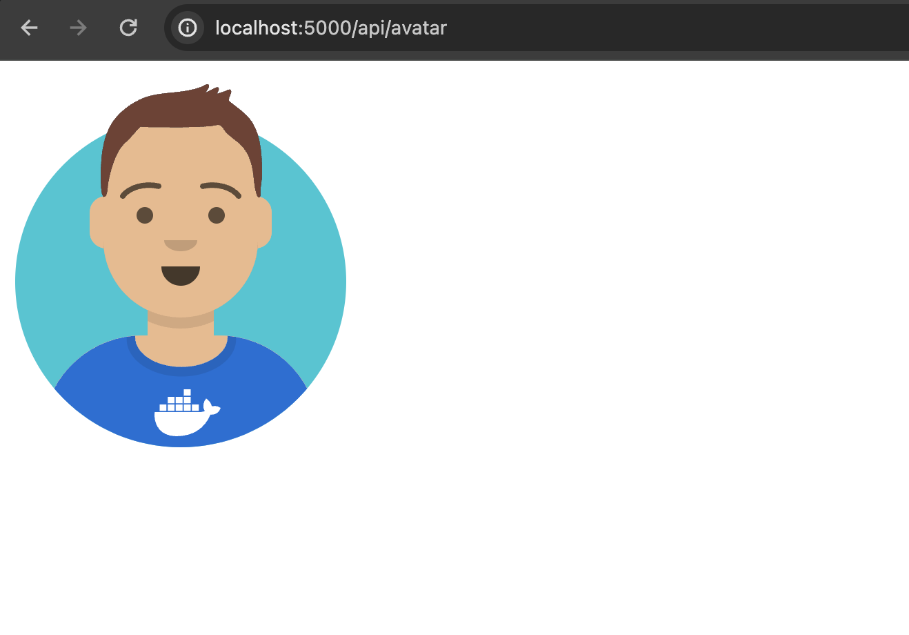

### Backend de API (Python 3.10 - Flask):

#### Prerrequisitos:
- Tener Python 3.10 instalado en tu sistema.
- Instalar Flask y las dependencias necesarias. Puedes hacerlo ejecutando el siguiente comando en tu terminal:
  ```
   pip install -r requirements.txt
  ```

#### Pasos para probar localmente:
1. **Configuración de Variables de Entorno:**
   - Define las variables de entorno necesarias (`FLASK_APP` y `FLASK_ENV`). Puedes hacerlo ejecutando los siguientes comandos en tu terminal:
     ```
     export FLASK_APP=app.py
     export FLASK_ENV=development
     ```
   
2. **Ejecutar el Servidor Flask:**
   - Ejecuta el siguiente comando en tu terminal para iniciar el servidor Flask:
     ```
     flask run
     ```

3. **Acceder a la API:**
   - Una vez que el servidor esté en funcionamiento, puedes acceder a la API a través de los endpoints definidos en el archivo `app.py`. Por ejemplo, si estás ejecutando el servidor localmente en tu máquina, puedes acceder a la API en la URL `http://localhost:5000`.

4. **Metodos**
    - /api/avatar
    - /api/avatar/spec
    - /ready



### Frontend SPA (Node.js 18 - React + Vite):

#### Prerrequisitos:
- Tener Node.js 18 instalado en tu sistema.
- Instalar las dependencias del proyecto. Puedes hacerlo ejecutando el siguiente comando en el directorio raíz del proyecto frontend:
  ```
  npm install
  ```

#### Pasos para probar localmente:
1. **Configuración de Variables de Entorno:**
   - Define las variables de entorno necesarias (`VITE_HOST` y `VITE_PORT`). Puedes hacerlo creando un archivo `.env` en el directorio raíz del proyecto frontend y agregando las siguientes líneas:
     ```
     VITE_HOST=0.0.0.0
     VITE_PORT=5173
     ```
   
2. **Ejecutar el Servidor de Desarrollo:**
   - Ejecuta el siguiente comando en tu terminal para iniciar el servidor de desarrollo de Vite:
     ```
     npm run dev
     ```

3. **Acceder a la Aplicación Frontend:**
   - Una vez que el servidor esté en funcionamiento, puedes acceder a la aplicación frontend a través de tu navegador web. Por defecto, la aplicación estará disponible en la URL `http://localhost:5173`.

